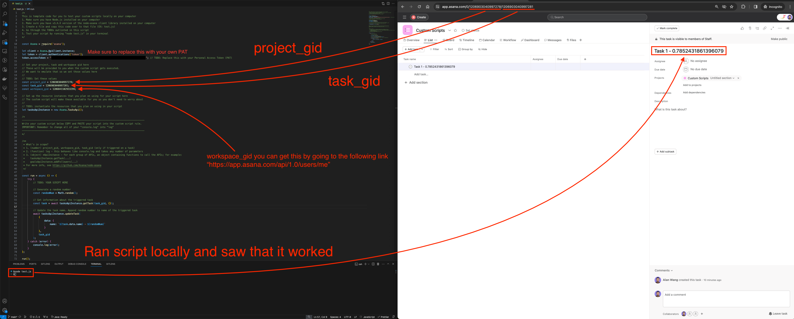
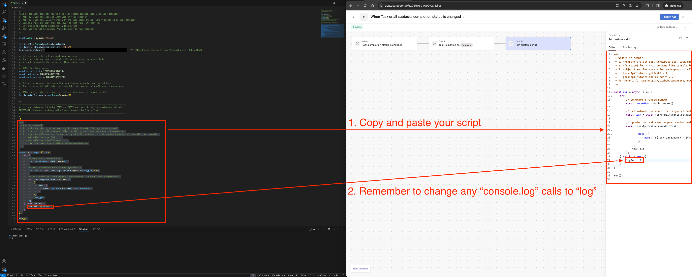
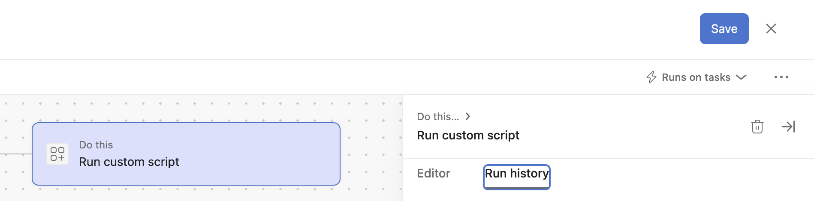
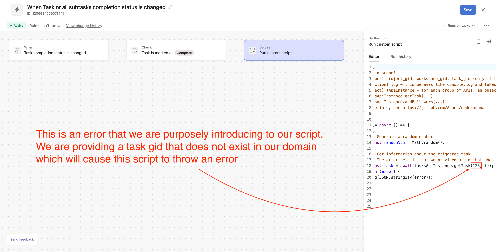
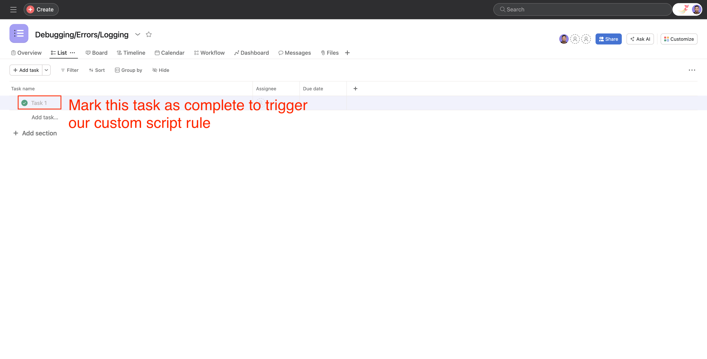
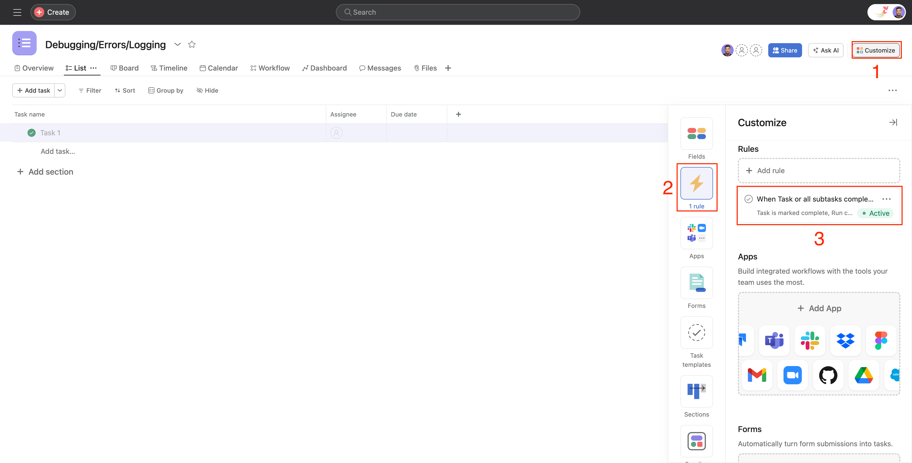
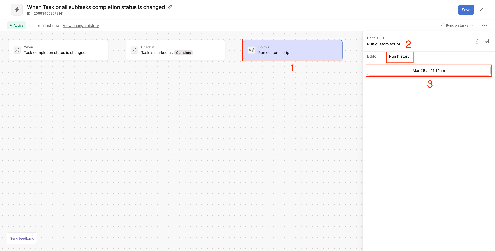
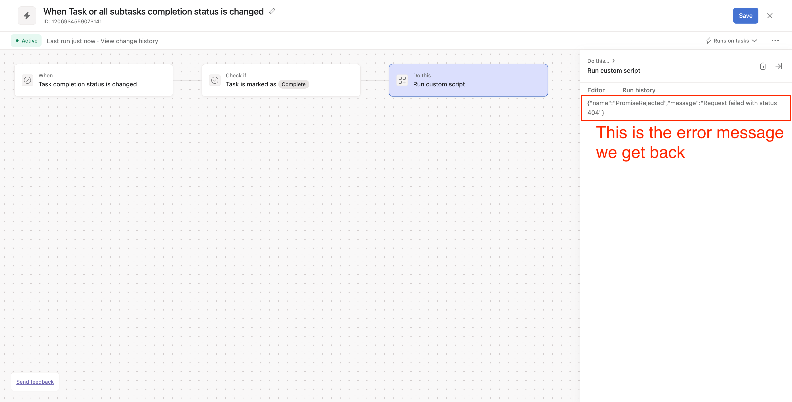

# custom-scripts-examples

## Installation

1. Inside of a project, navigate to > **"Customize"** > **"Rules"** > **"Create custom rule"**
2. Navigate to **"Do this..."** > **"External actions"** > **"Run script"** > **"Connect to Scripts by Asana"**
3. A new tab will open, displaying the Grant Permission page for the app. Click on **"Allow"**
4. You should now be authenticated and are now ready to start creating automation rules with Script Actions

## Usage: Default Script


https://github.com/user-attachments/assets/dbe56d8e-cc01-499b-bd20-b914b6f41afb


1. Inside of a project navigate to > **"Customize"** > **"Rules"** > **"Create custom rule"**
2. Select a trigger (e.g., **"Task is assigned"**):
3. Configure a condition for the **"+ Check if..."** step or delete that step
4. Navigate to  **"Do this..."** > **"External actions"** > **"Run script"** you should be presented with the script editor.
   This is where you will want to write/provide your script.
   
   Script Actions utilizes the [node-asana](https://github.com/Asana/node-asana) ([v3.X.X](https://www.npmjs.com/package/asana)) client library to make API calls to Asana.
   
   In each custom script, we provide you with the following variables:
   - `project_gid`: The project's gid
   - `task_gid`: The gid of the task that the rule triggered on
   - `workspace_gid`: The workspace gid

   You can utilize this information to write a Script Action scripts using the [node-asana](https://github.com/Asana/node-asana) ([v3.X.X](https://www.npmjs.com/package/asana)) client library.
   
   For this example, we will just uncomment the provided sample script. The sample script fetches the information about the triggered task and appends the text **"longer name"** to the end of the task name.
5. Click on the **"Publish rule"** button
6. Trigger your rule. In this scenario, we configured our rule to trigger when a task is assigned to a user in our project.

## Developing/Testing your script locally on your computer

The following is a way to write/test your script on your computer. You can copy the code below into your code editor and start working through the TODOs.

**Pre-requisite:**
1. Make sure you have [Node.js](https://nodejs.org/en/download) installed on your computer 
2. Make sure you have `v3.X.X` version of [node-asana](https://github.com/Asana/node-asana) ([npm](https://www.npmjs.com/package/asana)) installed on your computer
3. Create a file for your script. Copy and paste the below script into that file. EX: `test.js`
4. Go through the TODOs outlined in the below script
5. Test your script `node <YOUR_SCRIPT_FILE_NAME>.js`. EX: `node test.js`

**TIP:** You can reference the ["Documentation for API Endpoints"](https://github.com/Asana/node-asana?tab=readme-ov-file#documentation-for-api-endpoints) section of [node-asana](https://github.com/Asana/node-asana) `README.md` to reference sample code and endpoints for your script.

```javascript
/*
This is template code for you to test your custom scripts locally on your computer
1. Make sure you have Node.js installed on your computer
2. Make sure you have v3.X.X version of the node-asana client library installed on your computer
3. Create a file and copy this code over to that file (EX: test.js)
4. Go through the TODOs outlined in this script
5. Test your script by running "node test.js" in your terminal
*/

const Asana = require('asana');

let client = Asana.ApiClient.instance;
let token = client.authentications['token'];
// TODO: Replace <YOUR_PERSONAL_ACCESS_TOKEN> with your Personal Access Token (PAT)
// NOTE: This is only used for testing your script locally
token.accessToken = "<YOUR_PERSONAL_ACCESS_TOKEN>";

const log = console.log;

// Set your project, task and workspace gid here
// These will be provided to you when the custom script gets executed.
// We want to emulate that so we set those values here
//
// TODO: Set these values
const project_gid = "123";
const task_gid = "456";
const workspace_gid = "789";

/*
----------------------------------------------------------------------------------------
Write your script below, then COPY and PASTE your script into the script editor
----------------------------------------------------------------------------------------
*/

/**
 * What's in scope?
 * 1. (number) project_gid, workspace_gid, task_gid (only if triggered on a task)
 * 2. (function) log - this behaves like console.log and takes any number of parameters
 * 3. (object) Asana - the Asana node client
 * For more info, see https://github.com/Asana/node-asana
 */

// Instantiate Asana API resources
// TODO: instantiate the Asana resources that you plan on using in your script
// EX: If you want to make API calls to the tasks endpoint, uncomment the line below
// let tasksApiInstance = new Asana.TasksApi();

const run = async () => {
    // TODO: YOUR SCRIPT HERE
};

run();

```

<details>
<summary>Example use case</summary>

```javascript
/*
This is template code for you to test your custom scripts locally on your computer
1. Make sure you have Node.js installed on your computer
2. Make sure you have v3.X.X version of the node-asana client library installed on your computer
3. Create a file and copy this code over to that file (EX: test.js)
4. Go through the TODOs outlined in this script
5. Test your script by running "node test.js" in your terminal
*/

const Asana = require('asana');

let client = Asana.ApiClient.instance;
let token = client.authentications['token'];
// TODO: Replace <YOUR_PERSONAL_ACCESS_TOKEN> with your Personal Access Token (PAT)
// NOTE: This is only used for testing your script locally
token.accessToken = "<YOUR_PERSONAL_ACCESS_TOKEN>";

const log = console.log;

// Set your project, task and workspace gid here
// These will be provided to you when the custom script gets executed.
// We want to emulate that so we set those values here
//
// TODO: Set these values
const project_gid = "123";
const task_gid = "456";
const workspace_gid = "789";

/*
----------------------------------------------------------------------------------------
Write your custom script below COPY and PASTE your script into the custom script rule.
----------------------------------------------------------------------------------------
*/

/**
 * What's in scope?
 * 1. (number) project_gid, workspace_gid, task_gid (only if triggered on a task)
 * 2. (function) log - this behaves like console.log and takes any number of parameters
 * 3. (object) Asana - the Asana node client
 * For more info, see https://github.com/Asana/node-asana
 */

// Instantiate Asana API resources
let tasksApiInstance = new Asana.TasksApi();

const run = async () => {
    try {
        // Generate a random number
        const randomNum = Math.random();

        // Get information about the triggered task
        // NOTE: task_gid is provided as a number so we want to convert it to a string
        const task = await tasksApiInstance.getTask(task_gid.toString(), {});

        // Update the task name. Append random number to name of the triggered task
        await tasksApiInstance.updateTask(
            {
                data: {
                    name: `${task.data.name} - ${randomNum}`
                }
            },
            task_gid
        );
    } catch (error) {
        log(JSON.stringify(error));
    }
};

run();
```



</details>

## Debugging/Errors/Logging

If your custom script executes but doesn't yield the expected outcome, it might be due to encountering an error.
When this happens you can employ try-catch blocks along with the `log` function to assist in diagnosing your issue.
You can view your logs by going to your custom script rule > **"Run custom script"** > **"Run history"** .

<details>
<summary><b>Customize</b> > <b>Rules</b> > Select your custom script</summary>


</details>



Example custom script with error:
```javascript
/**
 * What's in scope?
 * 1. (number) project_gid, workspace_gid, task_gid (only if triggered on a task)
 * 2. (function) log - this behaves like console.log and takes any number of parameters
 * 3. (object) Asana - the Asana node client
 * For more info, see https://github.com/Asana/node-asana
 */

// Instantiate Asana API resources
let tasksApiInstance = new Asana.TasksApi();

const run = async () => {
    try {
        // Generate a random number
        const randomNum = Math.random();

        // Get information about the triggered task
        // The error here is that we provided a gid that does not exist in our domain
        const task = await tasksApiInstance.getTask("123", {});
    } catch (error) {
        log(JSON.stringify(error));
    }
};

run();

```

Example error shown in logs:
```
{"name":"PromiseRejected","message":"Request failed with status 404"}
```
<details>
<summary>more details</summary>






</details>

## Example Scripts

- [Automatically assign new task to user with the least number of assigned tasks in the project](example_scripts/auto_assign_task_based_on_workload.md)
- [Automatically update a goal metric when a deal is closed](example_scripts/update_goal_metric.md)
- [Generate a unique UUID when a task is added to a project](example_scripts/generate_unique_uuid.md)
