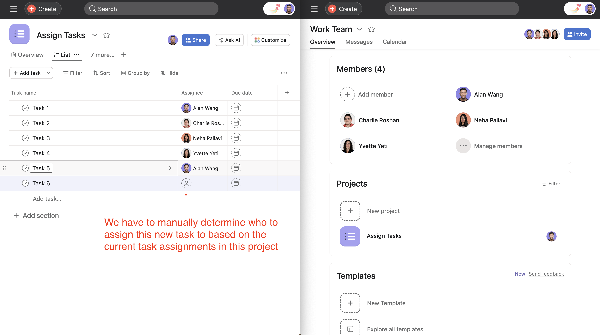
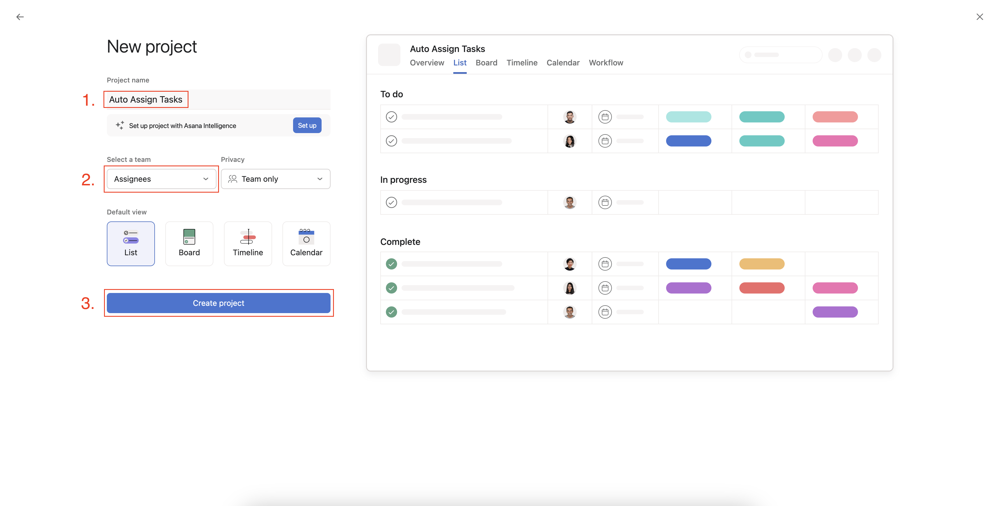
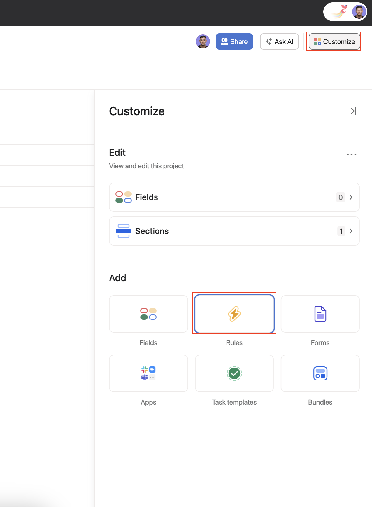
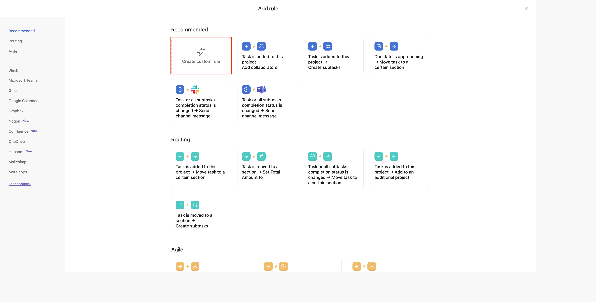
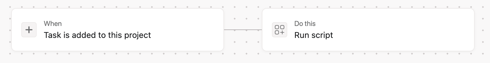
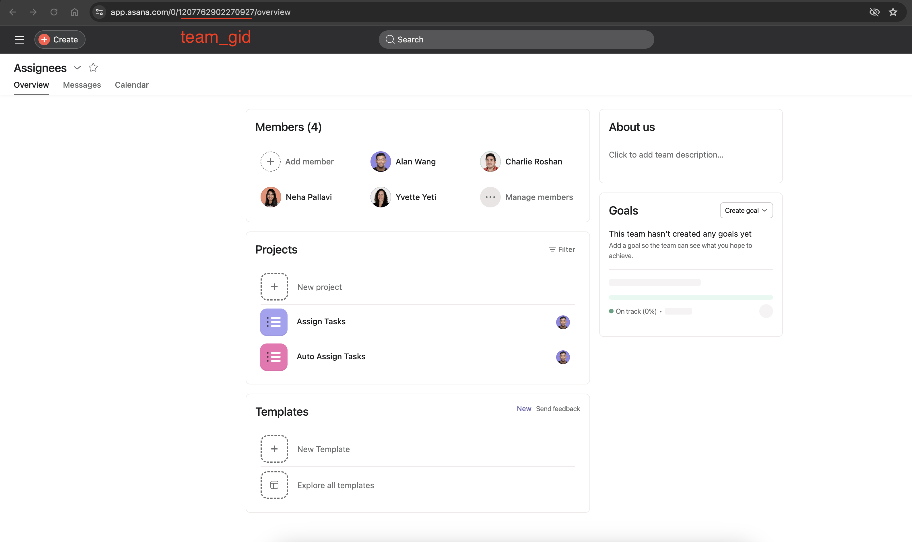
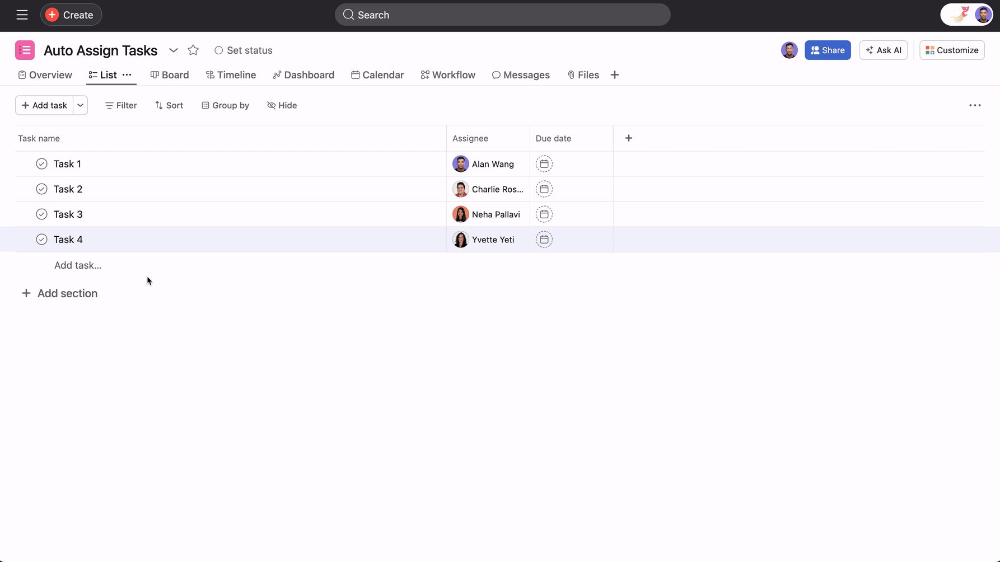

# Automatically assign new task to user with the least number of assigned tasks in the project

### Problem:
You want to assign new tasks to users in a project as evenly as possible based on their workload within that project. Right now you do this manually by looking at who already has tasks assigned to them and pick the person with the least tasks assigned to them.



### Solution:

Create a script action rule that automatically assigns new tasks to users based on the current workload of the team within that project.

EX: Let's say we have the following team members and task assigned :

1. `USER_A`
2. `USER_B`

- `TASK_1` -> `USER_A`
- `TASK_2` -> `USER_B`
- `TASK_3` -> `USER_A`

If a new task is added `TASK_4` it should be assigned to `USER_B` since `USER_A` already has two tasks (`TASK_1`, `TASK_3`) assigned to them.

### Scenario Setup:

1. Create a team called **"Assignees"**
2. Add at least one other member to that team
3. Create a project called **"Auto Assign Tasks"** with the **"Assignees"** team you just created
   <details>
   <summary>more details</summary>

   
   </details>
   
### Setup Rule Trigger:

1. Inside of your **"Auto Assign Tasks"** project navigate to **"Customize" -> "Rules" -> "Create custom rule"**
   <details>
   <summary>more details</summary>
   
   
   
   </details>
2. Configure the following:
   - **"+ When..."** -> **"Task is added to this project"**
   - **"Check if…"** -> Remove this card
   - **"Do this…"** -> **"External actions"** -> **"Run script"** -> Edit and copy over the script in the [Script](#script) section below
  

### Script
#### Pre-requisites:

Note down the following details for the below script:

1. `<YOUR_TEAM_GID>`: You can get the team gid from the URL of your team
   <details>
   <summary>more details</summary>

   
   </details>

We advise you to copy and paste this script into your code editor for editing. Once you're satisfied with your changes, simply copy the script into the rule editor.

```javascript
const TEAM_GID = "<YOUR_TEAM_GID>";

async function assignTaskToUserWithLowestIncompleteTasks() {
    try {
        // Step 1: Retrieve all incomplete tasks from the specified project
        const incompleteTasks = await tasksApiInstance.getTasksForProject(
            project_gid,
            {
                completed_since: "now",
                opt_fields: "assignee,due_on,completed",
            }
        );

        // Step 2: Retrieve all users from the specified team
        const teamUsers = await usersApiInstance.getUsersForTeam(TEAM_GID);

        // Step 3: Filter out tasks assigned to users who are not part of the team
        const userTaskMap = {};

        teamUsers.data.forEach((user) => {
            userTaskMap[user.gid] = 0;
        });
        incompleteTasks.data.forEach((task) => {
            if (
                task.assignee &&
                task.assignee.gid in userTaskMap
            ) {
                userTaskMap[task.assignee.gid]++;
            }
        });

        // Step 4: Assign the task with the specified GID to the user with the lowest number of incomplete tasks
        let minTasksCount = Infinity;
        let userWithMinTasks;
        Object.keys(userTaskMap).forEach((userId) => {
            if (userTaskMap[userId] < minTasksCount) {
                minTasksCount = userTaskMap[userId];
                userWithMinTasks = userId;
            }
        });

        // Step 5: Assign the task to the user with the lowest incomplete tasks
        await tasksApiInstance.updateTask(
            {
                data: {
                    assignee: userWithMinTasks,
                },
            },
            task_gid
        );

        log(
            "Task assigned successfully to the user with the lowest incomplete tasks on the team."
        );
    } catch (error) {
        log("An error occurred: " + error);
    }
}

// Call the function to execute the script
assignTaskToUserWithLowestIncompleteTasks();

```

### Result:



### Improvements
- If many tasks are added simultaneously within a short time frame (e.g., milliseconds apart), the first rule may not complete before the second rule starts. As a result, the second rule might fetch the list of assigned user tasks as if it were the same as the first, potentially leading to the assignment of the task to the same user as in the first script.
  - Similarly, this issue can occur when there are many incomplete tasks within the project. The script loops through each incomplete task, causing each rule to run longer.
- If the project has more than 1,000 incomplete tasks, the rule will fail because pagination needs to be implemented.
- In the scenario where everyone has the same amount of tasks assigned, the person at the top of the team list will always be assigned first. This is because of the code we wrote under `// Step 4: Assign the task with the specified GID to the user with the lowest number of incomplete tasks`