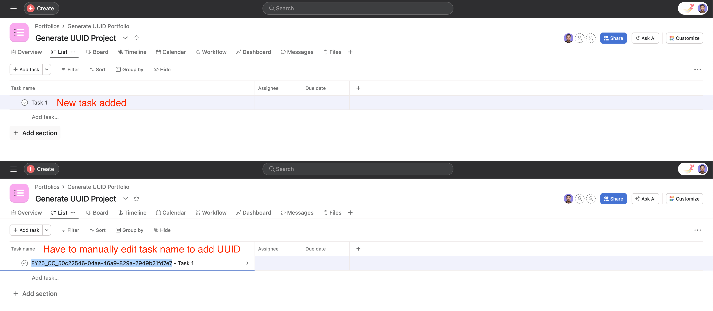
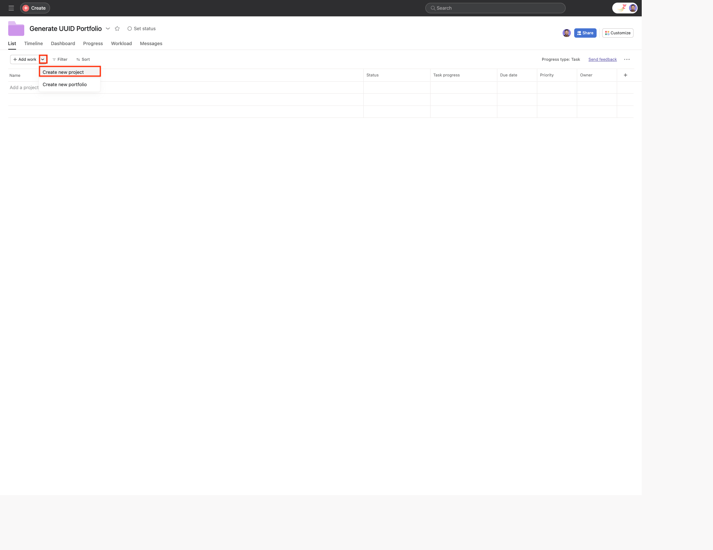
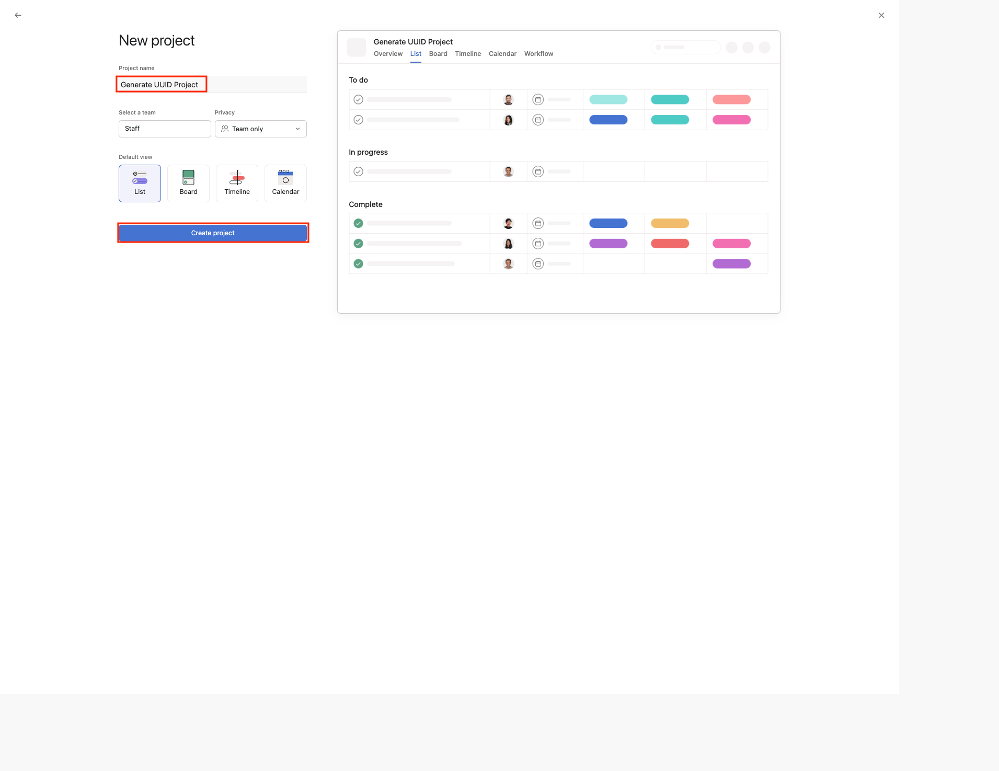
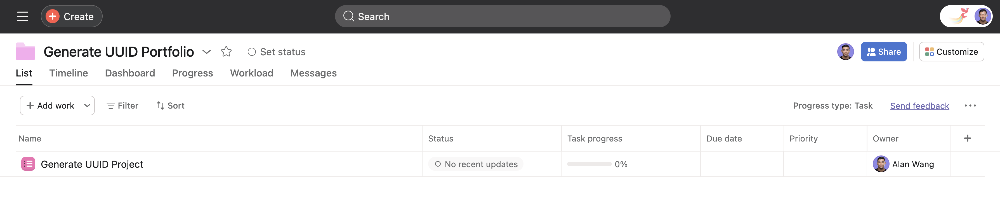
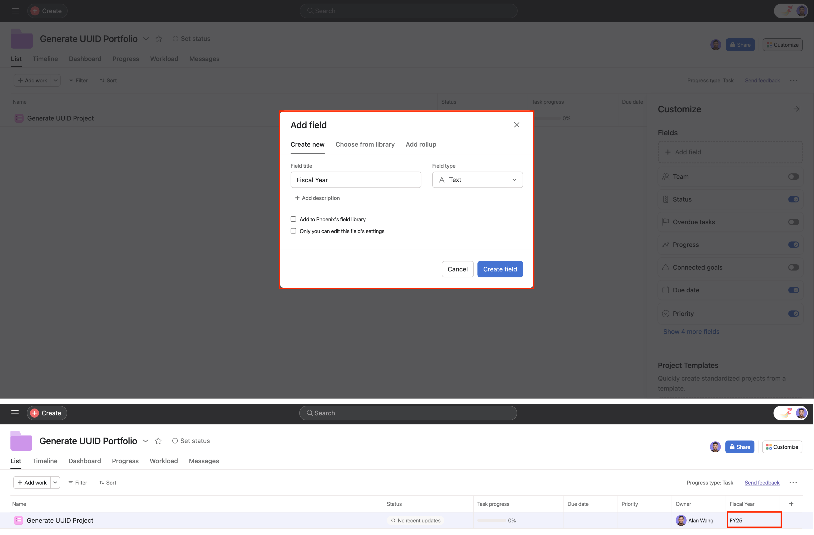
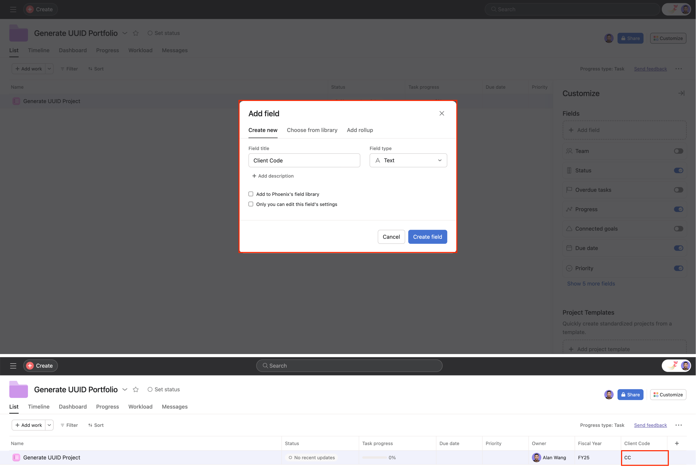
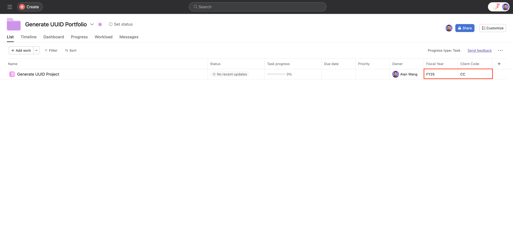
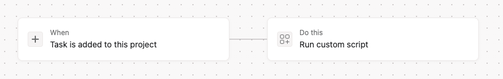
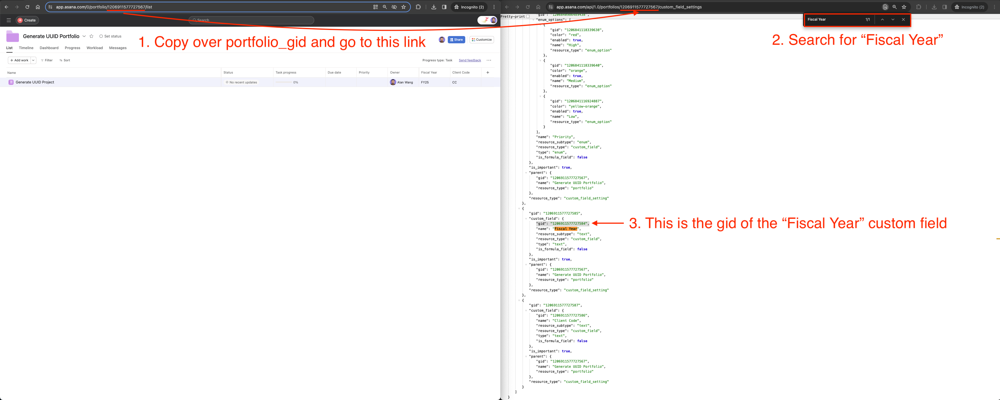
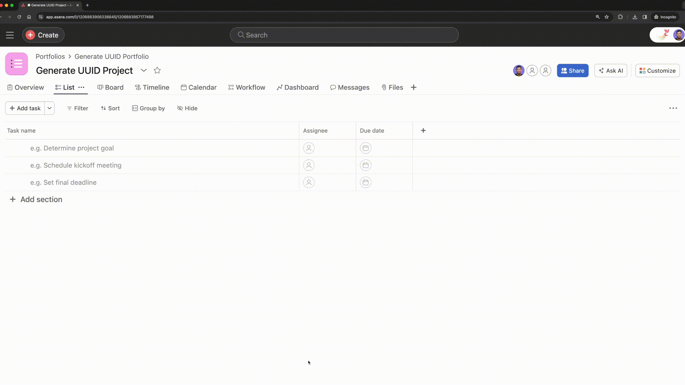

# Generate a unique UUID when task is added to a project

### Problem:
You want to generate a unique UUID for each new task you add to your project. Currently you have to do this manually each time you create a task.



### Solution:

Create a custom script rule that generates a unique UUID for your tasks when it gets added to your project.

### Scenario Setup:
1. Create a portfolio called **"Generate UUID Portfolio"**
2. Create a project called **"Generate UUID Project"** and add it to the **"Generate UUID Portfolio"** portfolio
   <details>
   <summary>more details</summary>

   
   
   
   </details>
3. Inside of the **"Generate UUID Portfolio"** portfolio, create and set two project custom fields to be used with the script to generate UUIDs for the tasks:
   <details>
   <summary>Create and set <b>"Fiscal Year"</b> custom field</summary>
   
   
   </details>
   <details>
   <summary>Create and set <b>"Client Code"</b> custom field</summary>
   
   
   </details>
4. Set values for the **"Fiscal Year"** and **"Client Code"** custom field for your **"Generate UUID Project"** project.
   <details>
   <summary>more details</summary>
   
   
   </details>

### Setup Rule Trigger:



### Script Pre-requisites:

Note down the following details for the below script:
1. `<YOUR_FISCAL_YEAR_CUSTOM_FIELD_GID>`: Replace `<PORTFOLIO_GID>` in the following link `https://app.asana.com/api/1.0/portfolios/<PORTFOLIO_GID>/custom_field_settings` and open that link up in the same browser as your logged in user. Find and use the `gid` of the **"Fiscal Year"** custom field.
   <details>
   <summary>more details</summary>

   
   </details>
2. `<NAME_OF_YOUR_CLIENT_CODE_CUSTOM_FIELD>`: Use the name you set when you were creating your **"Client Code"** custom field. In this case we named it **"Client Code"**.

   **NOTE:** this is case sensitive but you can modify the script to make this case-insensitive as needed.

### Script:

We advise you to copy and paste this script into your code editor for editing. Once you're satisfied with your changes, simply copy the script into the custom field rule editor.

```javascript
/**
 * What's in scope?
 * 1. (number) project_gid, workspace_gid, task_gid (only if triggered on a task)
 * 2. (function) log - this behaves like console.log and takes any number of parameters
 * 3. (object) *ApiInstance - for each group of APIs, an object containing functions to call the APIs; for example:
 *    tasksApiInstance.getTask(...)
 *    goalsApiInstance.addFollowers(...)
 * For more info, see https://github.com/Asana/node-asana
 */

function generateUUID() {
    return 'xxxxxxxx-xxxx-4xxx-yxxx-xxxxxxxxxxxx'.replace(/[xy]/g, function(c) {
        var r = Math.random() * 16 | 0, v = c === 'x' ? r : (r & 0x3 | 0x8);
        return v.toString(16);
    });
}

function findCustomFieldInResourceById(resourceData, customFieldId) {
    const customFields = resourceData?.custom_fields;
    const customField = customFields.find((field) => field?.gid === customFieldId);
    return customField || '';
}

function findFiscalYearCustomField(resourceData) {
    const fiscalYearFieldId = '<YOUR_FISCAL_YEAR_CUSTOM_FIELD_GID>';
    const customFieldData = findCustomFieldInResourceById(resourceData, fiscalYearFieldId);
    return customFieldData || '';
}

function findClientCodeCustomField(resourceData) {
    const clientCodeFieldReferenceId = '<NAME_OF_YOUR_CLIENT_CODE_CUSTOM_FIELD>';
    const customFields = resourceData?.custom_fields;
    const customFieldData = customFields.find((field) => {
        const nameMatches = field?.name?.includes(clientCodeFieldReferenceId);
        const hasDisplayValue = field?.display_value?.length > 0;
        return nameMatches && hasDisplayValue;
    });
    return customFieldData || '';
}

async function generateId(taskGid) {
    try {
        const projectDataObject = await projectsApiInstance.getProject(project_gid, { opt_fields: 'name,custom_fields' });
        const taskDataObject = await tasksApiInstance.getTask(taskGid);
        const projectData = projectDataObject?.data;
        const taskData = taskDataObject?.data;
        /* taskId is generated from the following:
            - fiscal year
            - client code
            - a unique ID number
            The new task name is then the new taskId + '-' +  existingTaskName
        */
        let fiscalYear = 'FYXX'; // Default placeholder if error
        let clientCode = 'XXXX'; // Default placeholder if error
        let uniqueId = 'YYYYYY'; // Default placeholder if error

        // Get the existing task name to pre-append to
        const existingTaskName = taskData?.name;

        // Get the fiscal year from the project custom field
        const fiscalYearFieldObject = findFiscalYearCustomField(projectData);
        const fiscalYearFieldValue = fiscalYearFieldObject?.display_value || '';
        if (fiscalYearFieldValue) {
            fiscalYear = fiscalYearFieldValue;
        }

        // Get the client code name and extract the client code from the project custom field
        const clientTextFieldObject = findClientCodeCustomField(projectData);
        const clientTextFieldValue = clientTextFieldObject?.display_value || '';

        // Check if we have extracted a value
        if (clientTextFieldValue) {
            clientCode = clientTextFieldValue;
        }
        // Generate a unique ID to append
        uniqueId = generateUUID();

        // Combine all the IDs together to generate the new name
        const newTaskId = `${fiscalYear}_${clientCode}_${uniqueId}`;
        const newTaskName = `${newTaskId} - ${existingTaskName}`;
        const taskBody = {
            data: {
                name: newTaskName,
            }
        }
        await tasksApiInstance.updateTask(taskBody, taskGid);
    } catch (error) {
        log(error);
    }
}

// Trigger rule action on the task_gid 
generateId(task_gid);
  
```

### Result:

