# Automatically update a goal metric when a deal is closed

### Problem:

A Solutions team keeps track of the amount of ARR that they've influenced on a goal metric. A member on the team has to manually update this goal metric each time they finish a request to match the value in their project.

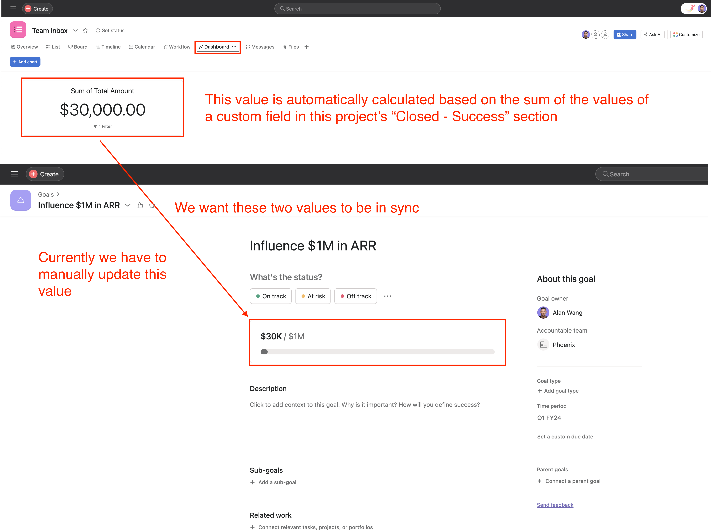

### Solution:

Create a script actions rule that automatically updates the goal metric whenever a person on the team completes a request. A request is completed when the task associated with the request is moved to the **"Closed - Success"** section of the project.

### Scenario Setup:
1. Create a goal called **"Influence $1M in ARR"**
   <details>
   <summary>more details</summary>

   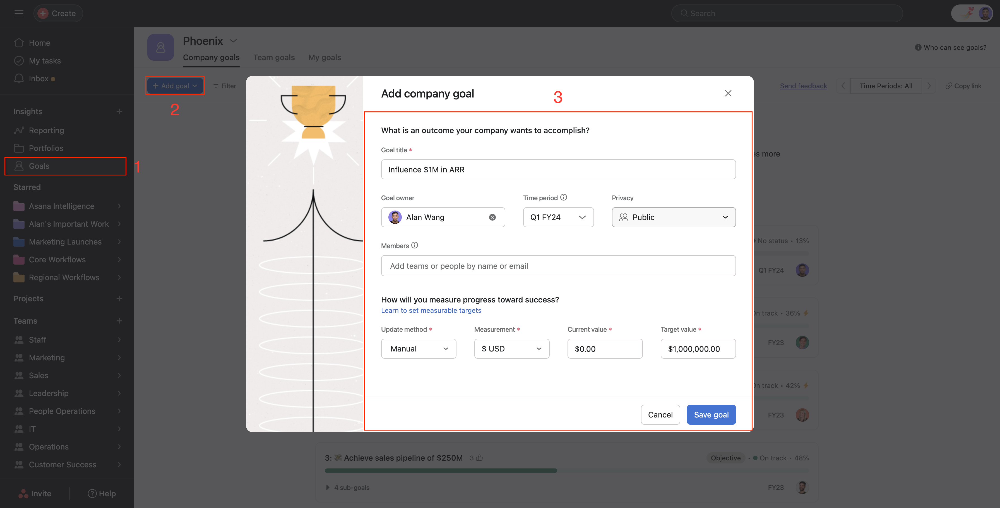
   </details>
2. Click on the "Progress settings" button on the goal and setup the following configurations:
   - **"Progress Source"** = **"Manual"**,
   - **"Measurement"** = **"$USD"**
   - **"Target Value"** = **"$1,000,000"**
    <details>
    <summary>more details</summary>

   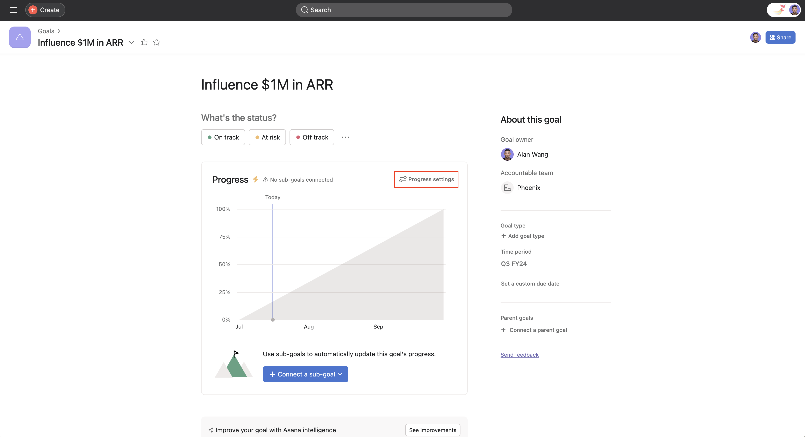
   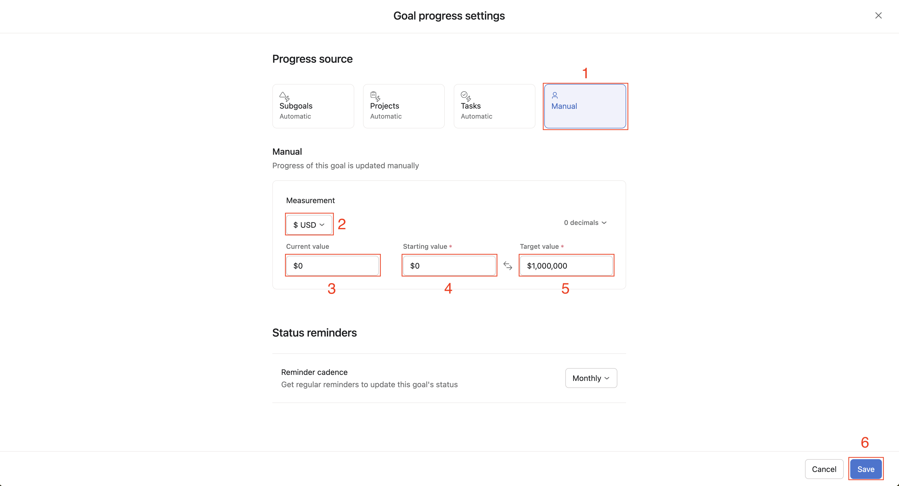
   </details>
3. Create a project called **"Team Inbox"**
   <details>
   <summary>more details</summary>

   
   </details>
4. Inside of the **"Team Inbox"** project, create a number custom field with `$USD` format and call it **"Total Amount"**
   <details>
   <summary>more details</summary>

   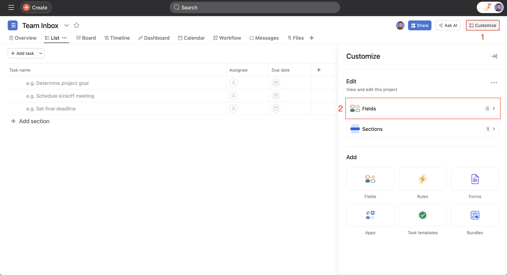
   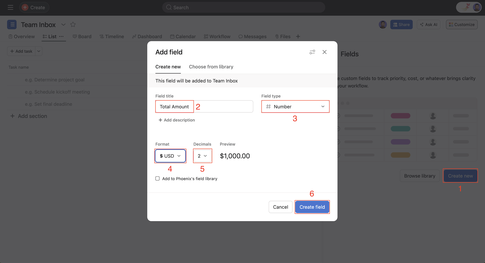
   </details>
5. Create the following sections for your project:
   - New Requests
   - In Review
   - In Progress
   - Closed - Success
   - Closed - Not Successful
    <details>
    <summary>more details</summary>

    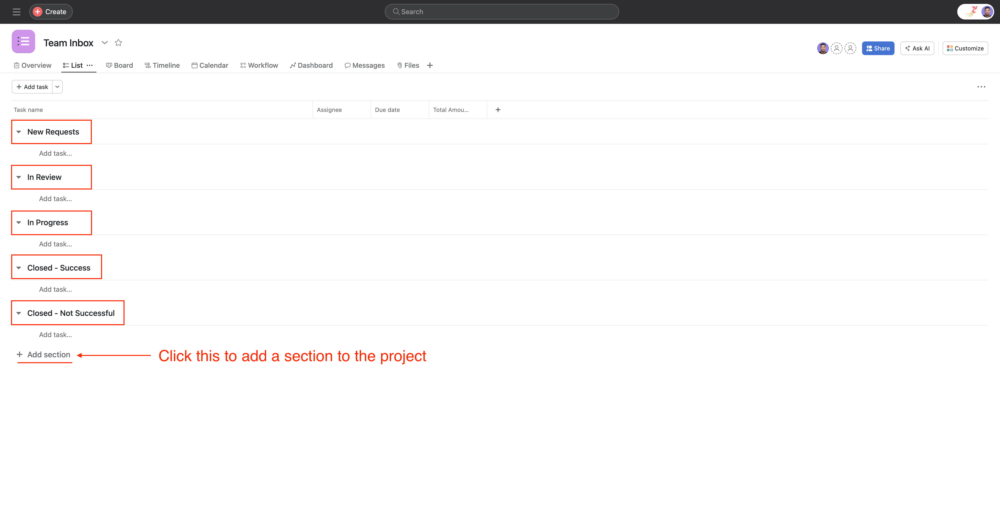
    </details>
6. Populate each section with at least one task and set a $ value for the **"Total Amount"** custom field on those tasks
    <details>
    <summary>more details</summary>

    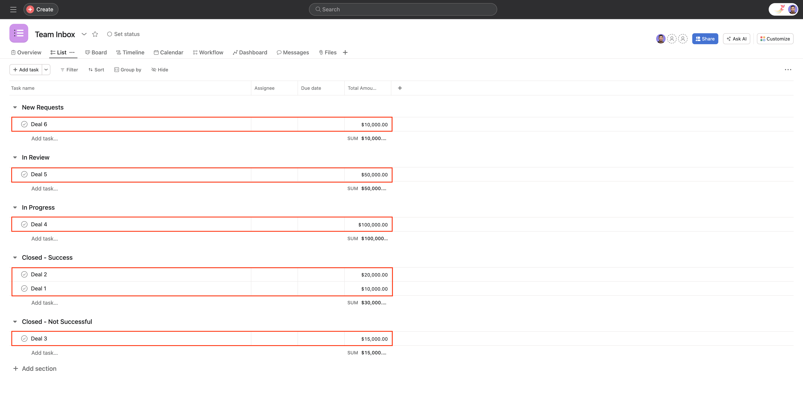
    </details>

### Setup Rule Trigger:

1. Inside of your **"Team Inbox"** project navigate to **"Customize" -> "Rules" -> "+ Add rule" -> "Create custom rule"**
   <details>
   <summary>more details</summary>
   
   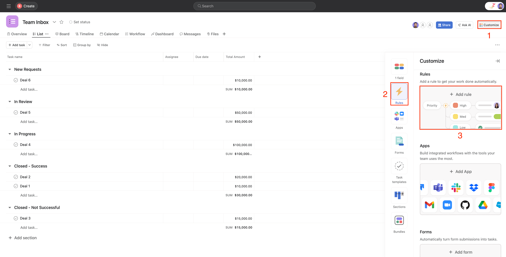
   
   </details>
2. Configure the following:
   - **"+ When..."** -> **"Task is moved to a section"**
   - **"Check if…"** -> **"Section is..."** -> select **"Closed - Success"**
   - **"Do this…"** -> **"External actions"** -> **"Run script"** -> Edit and copy over the script in the [Script](#script) section below
  
3. Click on the **"Publish rule"** button

### Script
#### Pre-requisites:

Note down the following details for the below script:
1. `<YOUR_GOAL_GID>`: You can get the goal `gid` from the URL of your goal
   <details>
   <summary>more details</summary>

   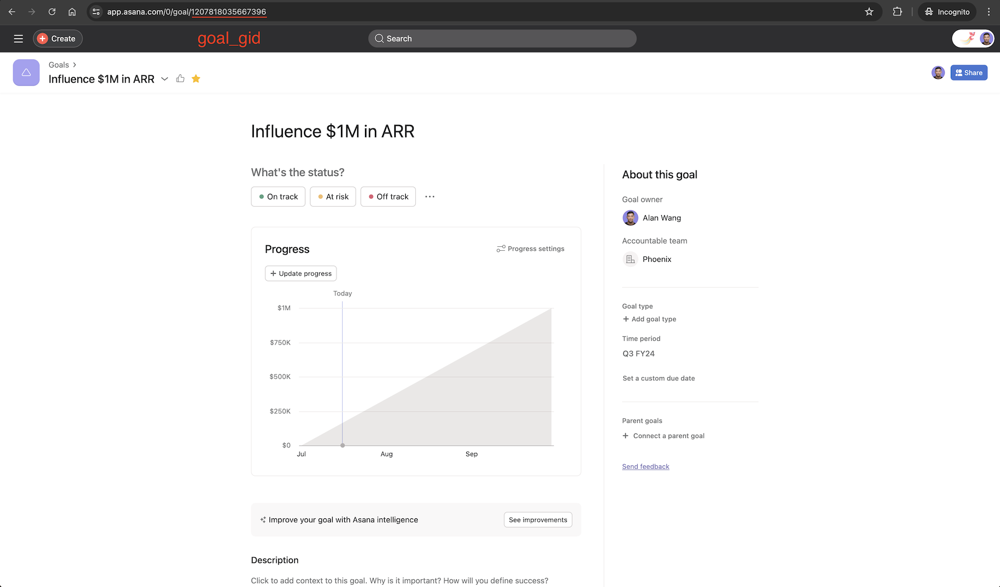
   </details>
2. `<YOUR_CUSTOM_FIELD_GID>`: Replace `<YOUR_PROJECT_GID>` in the following link `https://app.asana.com/api/1.0/projects/<YOUR_PROJECT_GID>/custom_field_settings` and open that link up in the same browser as your logged in user. Use the `gid` of the **"Total Amount"** custom field.
    <details>
   <summary>more details</summary>

   
   </details>
3. `<YOUR_SECTION_GID>`: Replace `<YOUR_PROJECT_GID>` in the following link `https://app.asana.com/api/1.0/projects/<YOUR_PROJECT_GID>/sections` and open that link up in the same browser as your logged in user. Use the `gid` of the **"Closed - Success"** section.
   <details>
   <summary>more details</summary>

   
   </details>

We advise you to copy and paste this script into your code editor for editing. Once you're satisfied with your changes, simply copy the script into the rule editor.

```javascript
const GOAL_GID = "<YOUR_GOAL_GID>";
const CUSTOM_FIELD_GID = "<YOUR_CUSTOM_FIELD_GID>";
const SECTION_GID = "<YOUR_SECTION_GID>";

// Instantiate Asana API resources
let goalsApiInstance = new Asana.GoalsApi();
let tasksApiInstance = new Asana.TasksApi();

// Function to get all tasks in a project's section
const getAllTasksForSection = async (sectionGid) => {
    let opts = {
        limit: 100,
        opt_fields: "custom_fields.number_value",
    };

    // Get all the tasks in the section by paginating through the results
    let tasks = await tasksApiInstance
        .getTasksForSection(sectionGid, opts)
        .then(async (response) => 
            {
                let result = [];
                let page = response;
                while(true) {
                    // Add items on page to list of results
                    result = result.concat(page.data);
                    // Fetch the next page
                    page = await page.nextPage();
                    // If the there is no data in the next page break from the loop
                    if (!page.data) {
                        break;
                    }
                }
                return result;
            },
            (error) => {
                log(error.response.body);
            }
        );

    return tasks;
};

// Function to calculate the sum of custom field values
const getTasksWithCustomFieldSum = async (customFieldGid) => {
    let customFieldSum = 0;

    const tasks = await getAllTasksForSection(SECTION_GID);

    // Sum the custom field values
    tasks.forEach((task) => {
        const customField = task.custom_fields.find(
            (field) => field.gid === customFieldGid
        );
        if (customField && customField.number_value !== null) {
            customFieldSum += customField.number_value;
        }
    });

    return customFieldSum;
};

// Function to update a goal metric
const updateGoalMetric = async (goalGid, newMetricValue) => {
    try {
        await goalsApiInstance.updateGoalMetric(
            {
                data: {
                    current_number_value: newMetricValue,
                },
            },
            goalGid
        );
    } catch (error) {
        log(`Failed to update goal ${goalGid} metric: ${error.response.body}`);
    }
};

const run = async () => {
    try {
        // Get the sum of custom field values across all tasks in a project's section
        const totalCustomFieldValue = await getTasksWithCustomFieldSum(
            CUSTOM_FIELD_GID
        );

        // Update the goal metric with the sum of custom field values
        await updateGoalMetric(GOAL_GID, totalCustomFieldValue);
    } catch (error) {
        log(JSON.stringify(error));
    }
};

run();

```

### Result:
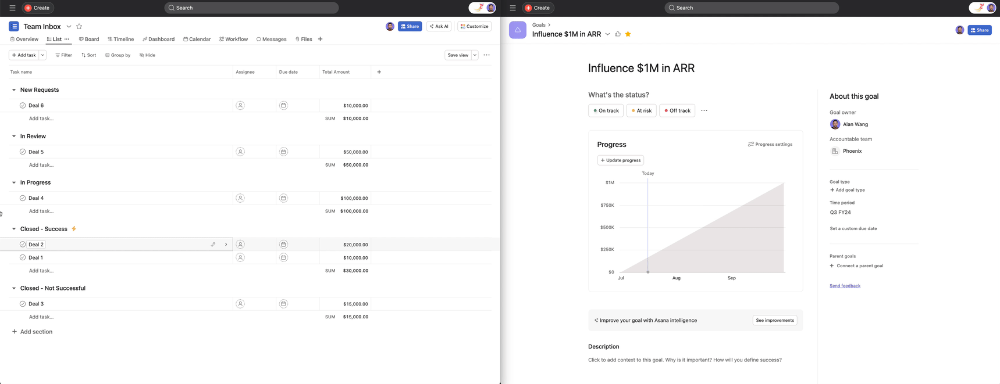
